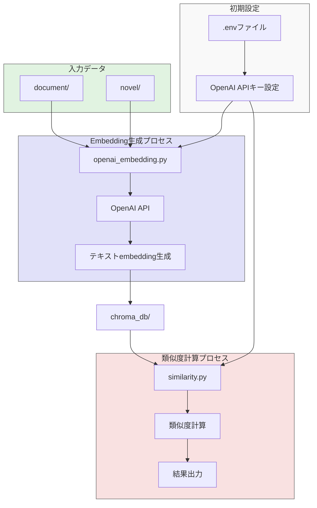

テキスト分析・類似度計算を行うプロジェクトです。

## データーフロー及び構造



## セットアップ

1. 必要なパッケージのインストール:
```bash
pip install -r requirements.txt
```

2. 環境変数の設定:
`.env`ファイルをプロジェクトのルートディレクトリに作成し、以下の内容を設定してください：
```
OPENAI_API_KEY=your_api_key_here
```

3. データファイルの準備:
- `document/`フォルダに分析対象のテキストファイルを配置
- `novel/`フォルダに小説テキストファイルを配置

## プロジェクト構成

- `embedding/`: テキストのembedding生成用スクリプト
- `similarity/`: テキスト間の類似度計算用スクリプト
- `document/`: 分析対象のテキストファイル（データは含まれません）
- `novel/`: 小説テキストファイル（データは含まれません）
- `chroma_db/`: ChromaDBのデータ保存ディレクトリ（データは含まれません）
- `.env`: 環境変数ファイル

## 使用方法

1. テキストのembedding生成:
```bash
python embedding/openai_ada002.py
```

2. 類似度計算:
```bash
python similarity/similarity.py
```

## 注意事項

- APIキーは`.env`ファイルで管理し、GitHubにはアップロードしないでください
- データファイルは各自で準備してください
- `chroma_db/`、`document/`、`novel/`フォルダのファイルは`.gitignore`に含まれています
